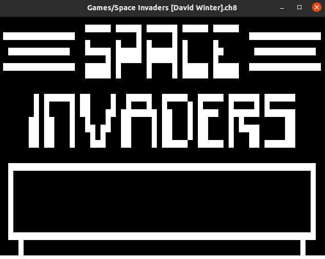
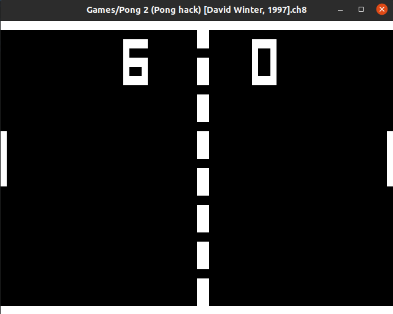

# Chip-8 Emulator

## Description

This is an emulator (interpreter more accurately) for the CHIP-8, an interpreted programming language, developed by Joseph Weisbecker and used on 8-bit microcomputers in the mid-1970s.

> Space Invaders on the CHIP-8 emulator.



> Pong on the CHIP-8 emulator.




It was implemented as a side project to understand better a systems architecture, by implementing every assembly instruction in code. Chip-8 is a very simple 8-bit microcomputer, with a small but complete set of instructions (only 35 opcodes).


## Tools
- The emulator is implemented in C++.
- The graphics are created with SDL2.
- A Makefile is used for building the project.

## Usage
### Requirements
- Currently it is only tested on Linux environment.
- The SDL2 library is needed in order to build. For Debian users install the following packets:
  ```
  sudo apt-get install libsdl2-2.0
  sudo apt-get install libsdl2-dev
  ```
For other Linux users follow the [SDL Guide](https://wiki.libsdl.org/Installation).

### Build
To build the project, just run the makefile in the repository:
```
make
```
This will create a `main` executable.

### How to play
In order to play a game, select one from the `Games/` folder and run the program with the game as a parameter, like:
```
./main Games/Paddle.ch8
```
All the games have the `.ch8` file extention.

## To Do
- [ ] fseek for file size not portable
- [ ] Change datatypes to uint8_t, uint16_t, uint32_t
- [ ] Add more Keyboard bindings and extra features
- [ ] Display and Graphics revisit for adjustments-fixes
- [ ] FIX emulation speed
- [ ] Add Audio Support
- [ ] Make it compact/executable (SDL library, comments, printf's)

## Resources
All credits go to the incredible resources, documentation and tutorials that are out there for anyone thats interested. Here are some that helped me and inspered me to make this project:
- Cowgod's [Chip-8 Technical Reference Reference](http://devernay.free.fr/hacks/chip8/C8TECH10.HTM)
- David Winter's [CHIP-8 emulation page](http://www.pong-story.com/chip8/)
- Matthew Mikolay's [Document for Chip-8 Specifications](http://mattmik.com/files/chip8/mastering/chip8.html)
- Laurence Muller's [Chip-8 Emulator Guide](http://www.multigesture.net/articles/how-to-write-an-emulator-chip-8-interpreter/)
- Wikipedia's [page](https://en.wikipedia.org/wiki/CHIP-8)

## Chip-8 Specifications
Below there are the Specifications of the microcomputer as a reference.

### General
- Simple, interpreted, programming language

### Memory
- 4KB (4,096 bytes = 2^12 bytes -> 12 bits addressable = 3 hex digits) of RAM, from location 0x000 (0) to 0xFFF (4095)
- The first 512 bytes, from 0x000 to 0x1FF, are where the original interpreter was located, and should not be used by programs.
- Most Chip-8 programs start at location 0x200 (512), but some begin at 0x600 (1536)

### Registers
Has 16 general purpose 8-bit registers (`V_0 - V_F`), also:
- `V_F` : Should not be used by any program, as it is used as a flag by some instructions.
- `I` : 16-bit register for memory addresses (only 12 bits used).
- `DT` : 8-bit register for delay timer register.
- `ST` : 8-bit register for sound timer register.
- `PC` : 16-bit program counter register to store the currently executing address.
- `SP` : 8-bit stack pointer is used to point to the topmost level of the stack.

### Stack
The stack is:
- An array of 16 16-bit values, used to store the address that the interpreter should return to when finished with a subroutine.
- Chip-8 allows for up to 16 levels of nested subroutines.


### Keyboard
The computers which originally used the Chip-8 Language had a 16-key hexadecimal keypad with the following layout:

| 1 | 2 | 3 | C |
|---|---|---|---|
| 4 | 5 | 6 | D |
| 7 | 8 | 9 | E |
| A | 0 | B | F |

Maps to this configuration:

| 1 | 2 | 3 | 4 |
|---|---|---|---|
| Q | W | E | R |
| A | S | D | F |
| Z | X | C | V |


This layout must be mapped into various other configurations to fit the keyboards of today's platforms.

### Display
 The original implementation of the Chip-8 language used a 64x32-pixel monochrome display with this format:
 ```
(0,0)   (63,0)
(0,31)  (63,31)
 ```

### Timers and Sounds
Chip-8 provides 2 timers, a delay timer and a sound timer:
- The delay timer is active whenever the delay timer register (`DT`) is non-zero.
  - This timer does nothing more than subtract 1 from the value of `DT` at a rate of 60Hz.
  - When `DT` reaches 0, it deactivates.
-  The sound timer is active whenever the sound timer register (`ST`) is non-zero.
  - This timer also decrements at a rate of 60Hz, however, as long as `ST`'s value is greater than zero, the Chip-8 buzzer will sound.
  - When `ST` reaches zero, the sound timer deactivates.

### Instructions
 The original implementation of the Chip-8 language includes 36 different instructions, including math, graphics, and flow control functions.
 - Instruction is 2 bytes (= 16 bit) in length and is represented using 4 hexadecimal digits.
 - Instruction are stored most-significant-byte (MSB) first.
 - 	In memory, the first byte of each instruction should be located at an even addresses.
 - If a program includes sprite data, it should be padded so any instructions following it will be properly situated in RAM.


### Fonts
Because many programs often need to output a number to the screen, CHIP-8 contains built-in font utilities to allow for simple output of characters using the DXYN instruction.
- All hexadecimal digits (0 - 9, A - F) have corresponding sprite data already stored in the memory of the interpreter.
- The following table displays these sprites and their corresponding sprite data.

| DIGIT |            HEX           |
|:-----:|:------------------------:|
|   0   | 0xF0 0x90 0x90 0x90 0xF0 |
|   1   | 0x20 0x60 0x20 0x20 0x70 |
|   2   | 0xF0 0x10 0xF0 0x80 0xF0 |
|   3   | 0xF0 0x10 0xF0 0x10 0xF0 |
|   4   | 0x90 0x90 0xF0 0x10 0x10 |
|   5   | 0xF0 0x80 0xF0 0x10 0xF0 |
|   6   | 0xF0 0x80 0xF0 0x90 0xF0 |
|   7   | 0xF0 0x10 0x20 0x40 0x40 |
|   8   | 0xF0 0x90 0xF0 0x90 0xF0 |
|   9   | 0xF0 0x90 0xF0 0x10 0xF0 |
|   A   | 0xF0 0x90 0xF0 0x90 0x90 |
|   B   | 0xE0 0x90 0xE0 0x90 0xE0 |
|   C   | 0xF0 0x80 0x80 0x80 0xF0 |
|   D   | 0xE0 0x90 0x90 0x90 0xE0 |
|   E   | 0xF0 0x80 0xF0 0x80 0xF0 |
|   F   | 0xF0 0x80 0xF0 0x80 0x80 |

### Memory Map
```
  +---------------+= 0xFFF (4095) End of Chip-8 RAM  
  |                |
  |                |
  |                |
  |                |
  |                |
  | 0x200 to 0xFFF |  
  |     Chip-8     |  
  | Program / Data |  
  |     Space      |  
  |                |
  |                |
  |                |
  +---------------+= 0x600 (1536) Start of ETI 660 Chip-8 programs  
  |                |
  |                |
  |                |
  +---------------+= 0x200 (512) Start of most Chip-8 programs  
  | 0x000 to 0x1FF |  
  | Reserved for   |  
  |  interpreter   |  
  +---------------+= 0x000 (0) Start of Chip-8 RAM
```
